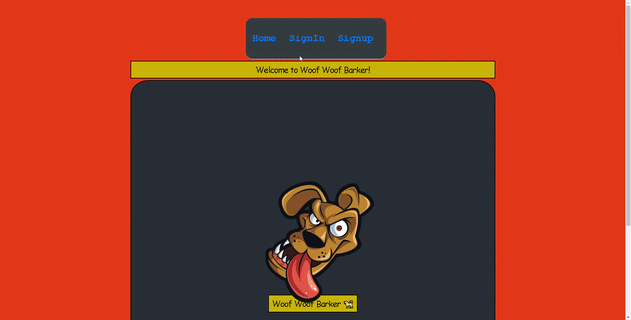

# full-stack-web-app
Full stack web application that allows users to authenticate themselves upon signin, allows users to have access to their own profiles and stores all user data within a database.

# Woof Woof Barker App
## MERN Fullstack Web Application
## Part 1- Planning of Web Application.

 The purpose of this app will over a platform where users are able to send messages 
    via their own profile that allows them to share their thoughts and opinions on a particular subject.

### The users will send messages in the form of barks similar to 'tweets' used in 'Tritter'.

 
  A dog barks as a form of communication or to have itself heard by others. The goal of this
  App, is to offer users just that by providing a platform for users to voice their opinions
  or thoughts on a matter.

### Software requirements of the App:

#### System Architecture
#### The 'MERN' stack will be used for the development of this Web Application.
* MongoDB-> Database,
* Express-> Backend,
* React-> Frontend,
* Node.js-> Backend.

##### Front-end
* I will be using MongoDB, Express, React and Node.js to create the Web App.
* The client(frontend) will be created using 'CRA'=> create-react-app(React) as the ReactJS framework.
* Within the React app, I'll be using Javascript, HTML & CSS.
* The React app will act as the user interface and offer the user experience.
* I've used some Css styling from the Skeleton framework as it is easy to use and speeds up styling needed within the app. 
  can be found @ ` http://getskeleton.com/ `.
* I will also be making use of custom style sheets where needed.

##### Database
* MongoDB will serve as the database which is where all user information and data will be stored, accessed and munipulated.

##### Back-end
* All back-end code will be written using Node.js & Express.js.
* The back-end server will act as a link which will communicate information between React(front-end) and the MongoDB(database).
* The back-end server will provide HTML pages to the user's device & accept HTTP requests from the user and respond accordingly.

Basic pre-requesites for the development of the App:

* Node.js(Back-end)
* npm registry(Back-end)
* Text Editor(Used to write all code)-> I'll be using Visual Studio Code as the preferred text editor.
* Postman || Insomnia (These will be used to test all HTTP requests.)

### Functional requirements of App:

 The App is designed for user interction:

* Users should be able to sign up for their own personal profile either directly or via a third party api.
* Users should be able to athenticate themselves with a username & password or a third part api like Google or Facebook.
* Users should be able to have their own profile to interact with. 
* Users should be able to send and share messages or posts.
* Users should be able to edit their messages or posts.
* Users should be able to remove their messages or posts.
* Users should be able to view their messages or posts.

### Non-Functional requirements of App:

* The App will aim to be user friendly.
* The App will aim to improve user efficiency. (The process of allowing a the user to achieve their goal faster, easier and smoother)
* The App will aim to ensure the security of user information and aim to protect it with the latest security features.
* The App will aim to prevent any unathorized user access.
* The App will aim to increase the systems reliability at all times.
* The App will aim to provide the user a speedy, yet smooth user experience. e.g Page load time etc.
* The App will aim to achieve optimal scalability to handle increased user interaction and to maintain cosistent behaviour with increased user volumes.
* If ever the system fails to provide a smooth user experience, users will be notified of any maintenance that needs to take place.
* Users will be notified of any updates which will be to the benefit of users, ensuring a pleasant user experience at all times.
* The App will be open for users to leave any suggestions or concerns that need to be dealt with.

### User Stories for App:

* As a user, I want to sign up or log into my own profile directly so that I may share my own messages personal messages with other users.
* As a user, I want to have various login or signup options available to be incase one of the options fail to respond, so that I may still be able to signip or log into my own profile.
* As a user, I want to be able to send out messages that will allow me to share my thoughts and opinion on a particular subject.
* As a user, I want to be able to remove any unwanted messages of mine so that it is no longer visible to other users.
* As a user, I want my messages to be stored until I decide to clear or remove them.
* As a user, I want to be able to edit any of my messages so that other users will see my updated messages.

The app will be deployed to heroku after development so that users will be able to use the Full Stack App.

Example of the steps needed to follow for deploying the Full Stack Web App to heroku can be found on: 'https://medium.com/crowdbotics/deploy-a-mern-stack-app-on-heroku-b0c255744a70'.

### Display of web application in action:

### Use of code:
* To use or edit code, load files to local drive.
* Open files in a text editor of your choice.
* Navigate to back end files, root directory of folder via the terminal and type "npm i" |or| "npm install" to install node-modules.
* Navigate to front end files, client, via the terminal and type "npm i" |or| "npm install" to install node-modules.
* Type "npm run dev" to run both front and back end after node-modules have been installed.
* The app should open up in your default browser and be available to use.

Happy Coding :sunglasses:
